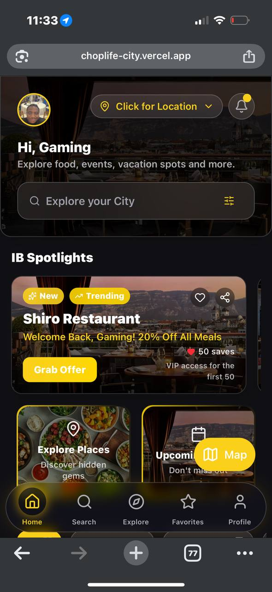

# Mudiaga | Full-Stack Software Engineer

> **Proactive software engineer building scalable, user-centric web solutions with modern technologies.**



## 🚀 Overview

Welcome to my portfolio repository. This project showcases my journey as a Full-Stack Software Engineer, highlighting my ability to build performant, accessible, and aesthetically pleasing applications. It serves as a central hub for my projects, technical writing, and professional background.

**Live Site:** [mudiaga.dev](https://mudiaga.dev)

## 🛠 Tech Stack

I leverage a modern, robust tech stack to deliver high-quality software:

*   **Frontend:**    
*   **Backend:**   
*   **Database:**   
*   **Tools:**  

## 🌟 Featured Projects

### [OpenHealth NG](/projects/openhealth-ng)
**Description:** A consolidated healthcare directory for Nigeria, providing standardized access to over 2,000 facilities.
*   **Key Tech:** Next.js 15, Supabase (PostGIS), React-Leaflet.
*   **Highlight:** Reduced geospatial search queries from ~800ms to <50ms using PostGIS indexing.

### [Energy Backend](/projects/energy-backend)
**Description:** A production-grade backend system for oil & gas production logging.
*   **Key Tech:** Python, FastAPI, DDD, SQLAlchemy.
*   **Highlight:** Implemented strict auditability and immutable logs for regulatory compliance.

### [ChopLife IB](/projects/choplife-ib)
**Description:** A premium discovery platform for lifestyle spots in Ibadan.
*   **Key Tech:** Next.js, Redux Toolkit, TanStack Query.
*   **Highlight:** Mobile-first design with optimistic UI updates for a native app-like feel.

### [Weekly Quiz](/projects/weekly-quiz)
**Description:** A gamified learning platform for blockchain education.
*   **Key Tech:** Next.js, Zustand, Supabase Realtime.
*   **Highlight:** High-concurrency support with Redis-backed state management.

## 🏁 Getting Started

To run this portfolio locally:

1.  **Clone the repository:**
    ```bash
    git clone https://github.com/Mudigram/portfolio.git
    cd portfolio
    ```

2.  **Install dependencies:**
    ```bash
    npm install
    # or
    yarn install
    ```

3.  **Run the development server:**
    ```bash
    npm run dev
    ```

4.  Open [http://localhost:3000](http://localhost:3000) with your browser.

## 📄 License

This project is open source and available under the [MIT License](LICENSE).

---

**Connect with me:**
[LinkedIn](https://linkedin.com/in/mudiaga) | [Twitter](https://twitter.com/Mudigram) | [Email](mailto:hello@mudiaga.dev)
